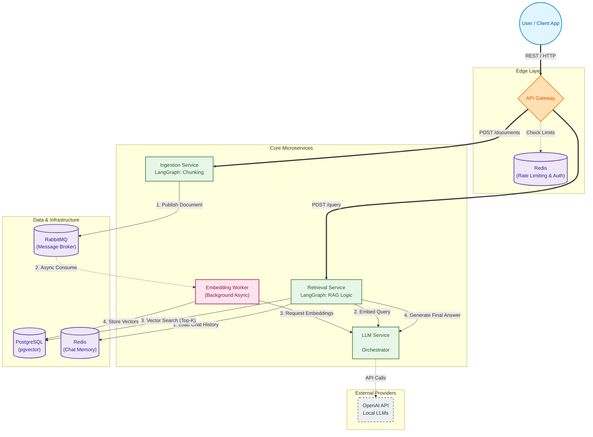

# RAG Microservice Platform

Production-grade Retrieval-Augmented Generation (RAG) platform built with microservice architecture.

## Architecture



| Service               | Port | Description                                        |
| --------------------- | ---- | -------------------------------------------------- |
| **API Gateway** | 8000 | Central entry point, auth, rate limiting           |
| **Ingestion**   | 8001 | Document upload, chunking (LangGraph pipeline)     |
| **Retrieval**   | 8002 | Hybrid search, RAG generation (LangGraph pipeline) |
| **LLM Service** | 8003 | LLM orchestration (OpenAI / Local)                 |
| **Worker**      | —   | Async embedding generation via RabbitMQ            |


## Quick Start

### Prerequisites

- Docker & Docker Compose
- (Optional) `kubectl` for K8s deployment

### 1. Clone & Configure

```bash
cd rag_micro
cp .env.example .env
# Edit .env with your OPENAI_API_KEY (or use LLM_PROVIDER=local)
```

### 2. Start All Services

```bash
# Core services only
make up

# With observability stack (Prometheus, Grafana, Loki)
make up-full
```

### 3. Verify

```bash
# Check all services
make ps

# Health check
curl http://localhost:8000/health

# Readiness check (all dependencies)
curl http://localhost:8000/ready
```

### 4. Try It Out

```bash
# Ingest a document
curl -X POST http://localhost:8000/api/v1/documents \
  -H "Content-Type: application/json" \
  -H "X-API-Key: default-api-key-change-me" \
  -d '{
    "title": "RAG Overview",
    "content": "RAG combines retrieval with generation for accurate answers...",
    "doc_type": "text"
  }'

# Query with RAG
curl -X POST http://localhost:8000/api/v1/query \
  -H "Content-Type: application/json" \
  -H "X-API-Key: default-api-key-change-me" \
  -d '{
    "question": "What is RAG?",
    "top_k": 5
  }'
```

## Observability

| Tool                | URL                    | Credentials                    |
| ------------------- | ---------------------- | ------------------------------ |
| Grafana             | http://localhost:3001  | admin / admin                  |
| Prometheus          | http://localhost:9090  | —                             |
| RabbitMQ Management | http://localhost:15672 | rag_user / rag_secret_password |

## Key Features

### LangGraph Pipelines

- **Ingestion Pipeline**: `validate → extract → chunk → publish → update_status`
- **RAG Pipeline**: `analyze_query → retrieve → rerank → generate → cite`

## Kubernetes Deployment

```bash
# Apply all manifests
make k8s-apply

# Delete all resources
make k8s-delete
```

## Testing

```bash
make test          # All tests
make test-unit     # Unit tests only
make lint          # Ruff linter
make format        # Ruff formatter
```

